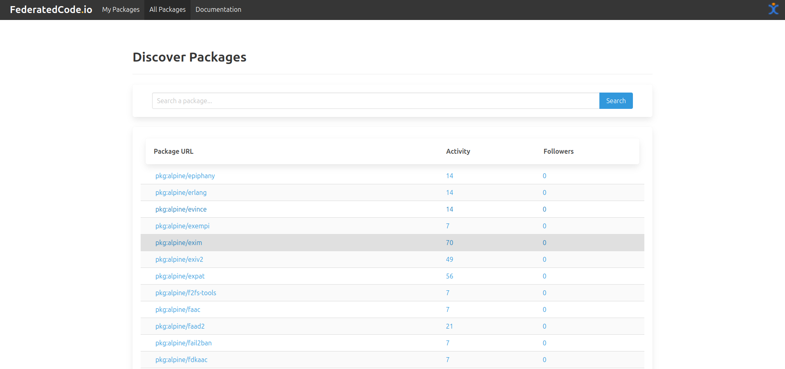
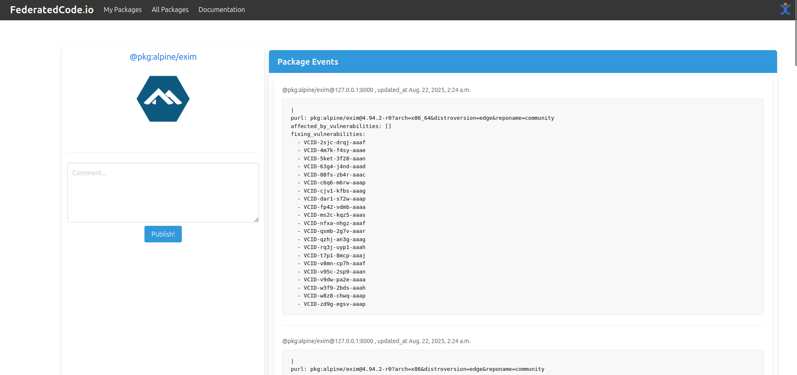

.. _tutorial_federate_vuln:

Syncing VulnerableCode Metadata with FederatedCode
=============================================================

Fork the FederatedCode Data Vulnerablecode Repository
------------------------------------------------------

Visit https://github.com/aboutcode-data/vulnerablecode-data and fork the repository.

Add Data Repository in FederatedCode
-------------------------------------

Go to http://127.0.0.1:8000/create-repo and add the repository URL: https://github.com/<YOUR-USER-NAME>/vulnerablecode-data, and **Click "Submit" button**.

1. .. image:: img/tutorial_getting_started_repo_vulnerablecode_link_add.png

2. .. image:: img/tutorial_getting_started_repo_vulnerablecode_success_link.png

Sync Vulnerablecode metadata
----------------------------

Run the following command to sync the vulnerablecode metadata from the FederatedCode Git repository

.. code-block:: bash

    python manage.py sync sync_vulnerablecode

Click on `Packages` link
--------------------------

.. image:: img/tutorial_getting_started_step_packages.jpg

Click on any PURL link
----------------------

Package Activity
----------------

You can now see the package event data.

